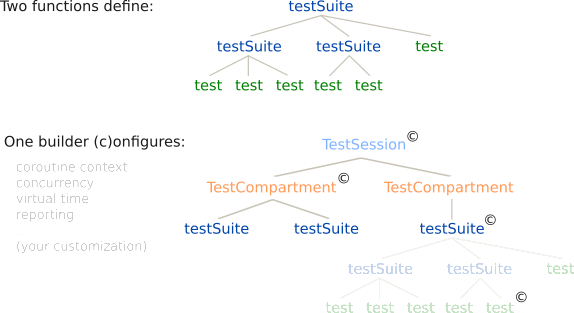

<h1>
  
  TestBalloon
</h1>

TestBalloon is a **next generation Kotlin test framework**, built from the ground up for Kotlin Multiplatform and coroutines.

## Why TestBalloon?

_TestBalloon makes writing all kinds of Kotlin tests simple and fun, everywhere._

✅️ **Use state-of-the-art test organization** with expressive names, an unrestricted hierarchical structure, multi-level configuration, dynamic test generation, parallelism and fixtures.

✅️ **Test faster** without extra code generation tasks, reflection or classpath scanning.

✅️ **Write tests quickly with ease**, using TestBalloon's lightweight, yet powerful and extensible API.

✅️ Be **Multiplatform first** and **coroutines first** with a single API for all platforms.

✅️ Run **Android instrumented tests** and **Android local tests** without [legacy restrictions](documentation/Android_Platform_Support.adoc).

✅️ **Run and debug individual tests** from the editor with TestBalloon's IntelliJ IDEA plugin.

✅️ Use **new Kotlin releases** as they appear, while retaining **backward compatibility** with Kotlin 2.0.

## How to use TestBalloon

1. Add the TestBalloon Gradle plugin to your build script:

        plugins {
            id("de.infix.testBalloon") version "$testBalloonVersion"
        }

2. Add a dependency for the TestBalloon framework core library:

    * For Kotlin Multiplatform, use:

          commonTest {
              dependencies {
                  implementation("de.infix.testBalloon:testBalloon-framework-core:$testBalloonVersion")
              }
          }

    * For Kotlin Multiplatform with Android local tests, add:

          androidUnitTest {
              dependencies {
                  implementation("de.infix.testBalloon:testBalloon-framework-core-jvm:$testBalloonVersion")
              }
          }

    * For Kotlin Multiplatform with Android instrumented tests, add:

          androidInstrumentedTest {
              dependencies {
                  implementation("androidx.test:runner:$androidxRunnerVersion")
                  implementation("de.infix.testBalloon:testBalloon-framework-core:$testBalloonVersion")
              }
          }

    * For Android-only local tests, use:

          dependencies {
              testImplementation("de.infix.testBalloon:testBalloon-framework-core-jvm:$testBalloonVersion")
          }

    * For Android-only instrumented tests, use:

          dependencies {
              androidTestImplementation("androidx.test:runner:$androidxRunnerVersion")
              androidTestImplementation("de.infix.testBalloon:testBalloon-framework-core:$testBalloonVersion")
          }

   See also the configuration examples in [examples/general], [examples/android] and [examples/multiplatform-with-android].

3. Add a dependency for the assertion library of your choice.

    - For kotlin-test assertions:

          implementation(kotlin("test"))

    - For Kotest assertions with support for soft assertion and clues:

          implementation("de.infix.testBalloon:testBalloon-integration-kotest-assertions:$testBalloonVersion")

4. Write a test:

       val MyFirstTestSuite by testSuite {
           test("string length") {
               assertEquals(8, "Test me!".length)
           }
       }

5. Run tests via the familiar Gradle test targets.

6. Install the [TestBalloon plugin for IntelliJ IDEA] from the JetBrains Marketplace to run individual tests or test suites via the editor’s gutter icons.

## What to expect

### Structure tests with a simple Multiplatform DSL

The TestBalloon DSL uses just two central functions, `testSuite` and `test`. Test suites can nest on all platforms, including Kotlin/JS (Node, browser) and Kotlin/Wasm (Node, browser, WASI).

TestBalloon has a unified API for all targets, residing in the `common` source set.

    val MyTestSuite by testSuite {                 // Define a top-level test suite.
        test("string length") {                    // Define a test.
            assertEquals(8, "Test me!".length)     // Use the assertion library of your choice.
        }

        testSuite("integer operations") {          // Nest test suites.
            test("max") {
                assertEquals(5, max(5, 3))
            }

            test("min") {
                delay(10.milliseconds)             // Use coroutines everywhere, nesting along with suites.
                assertEquals(3, min(5, 3))
            }
        }
    }

### Coroutines everywhere

When tests execute, each test suite becomes a coroutine, as does each test. These coroutines nest naturally, making it easy to inherit coroutine contexts and manage resource setup and tear-down (more on this later).

### Write dynamic tests in plain Kotlin

Inside the trailing lambdas of `testSuite` and `test`, you can use all Kotlin constructs (variable scopes, conditions, loops) to create tests dynamically. There is no extra dynamic/data/factory API you need to learn. Also, no annotations, no magic.

    val Dynamic by testSuite {
        val testCases = mapOf(
            "one" to 3,
            "two" to 3,
            "three" to 5
        )

        testCases.forEach { (string, expectedLength) ->
            test("length of '$string'") {
                assertEquals(expectedLength, string.length)
            }
        }
    }

### Share state with test fixtures

Use test fixtures for efficient, scoped shared state:

    val MyTestSuite by testSuite {
        val starRepository = testFixture {      // Declare a test fixture at zero cost if not used.
            StarRepository()                    // Use suspend functions in setup code.
        } closeWith {
            disconnect()                        // Use suspend functions in (optional) tear-down code.
        }

        testSuite("actual users") {
            test("alina") {
                assertEquals(4, starRepository().userStars("alina"))    // Use the fixture, which initializes lazily.
            }

            test("peter") {
                assertEquals(3, starRepository().userStars("peter"))    // Reuse the same fixture in other tests, sharing its setup cost.
            }
        }
    }                                           // The fixture will close automatically when its suite finishes.

### Extend TestBalloon's DSL

#### Custom tests and test suites

Use idiomatic Kotlin to define your own types of tests and test suites, like this test variant with an `iterations` parameter:

    fun TestSuite.test(name: String, iterations: Int, action: suspend TestExecutionScope.() -> Unit) {
        for (iteration in 1..iterations) {
            test("$name#$iteration") {
                action()
            }
        }
    }

_The IntelliJ IDEA plugin may not recognize invocations of your custom function as defining a test or test suite. In that case, [add a `@TestDiscoverable` annotation to your custom test] or test suite function._

#### Wrappers

You can use TestBalloon’s wrappers for setup and tear-down code. Inside the wrappers, Kotlin idioms like `withTimeout` and `try`/`catch` blocks can surround tests and suites.

- [`aroundAll`] wraps a lambda around an entire test suite.

- [`aroundEach`] wraps a lambda around each test of a test suite (including those in child suites).

### Multi-level configuration via a single builder API

Configure your tests, test suites, and global settings through a unified, small-surface API (the `TestConfig` builder). You can compose existing configurations as needed, and supply your own custom configurations.

    testSuite(
        "let's test concurrency",
        testConfig = TestConfig
            .invocation(TestInvocation.CONCURRENT)              // Use concurrent test execution instead of the sequential default.
            .coroutineContext(dispatcherWithParallelism(4))     // Parallelize as needed (and the platform supports).
            .statisticsReport()                                 // A custom configuration for extra reporting.
    )

#### Global configuration, compartments

If you declare a subclass of `TestSession`, its `testConfig` parameter defines the global configuration for the entire compilation module. This example extends the framework’s default configuration:

    class MyTestSession : TestSession(testConfig = DefaultConfiguration.statisticsReport())

To run some test suites in isolation, and/or provide them with special configuration, use`TestCompartment`s. These group top-level test suites, with each compartment running in isolation.

`TestSession` and `TestCompartment`s are just special types of `TestSuite`s that form the top of the test element tree.

## Examples and documentation

Find examples demonstrating TestBalloon’s capabilities in [examples/general], and an example showing how to use TestBalloon with Kotest assertions in [examples/with-kotest-assertions].

The TestBalloon public API includes source code documentation.

## More Information

If you’d like to know why and how TestBalloon came to life, here is some [background].

You are wondering why TestBalloon works the way it does? Read about its [design considerations].

Finally, there is a brief [introduction to development].

[TestBalloon plugin for IntelliJ IDEA]: https://plugins.jetbrains.com/plugin/27749-testballoon

[add a `@TestDiscoverable` annotation to your custom test]: examples/general/src/commonTest/kotlin/com/example/testLibrary/TestVariants.kt

[`aroundAll`]: examples/general/src/commonTest/kotlin/com/example/UsingAroundAll.kt

[`aroundEach`]: examples/general/src/commonTest/kotlin/com/example/UsingAroundEach.kt

[examples/android]: examples/android/build.gradle.kts

[examples/multiplatform-with-android]: examples/multiplatform-with-android/build.gradle.kts

[examples/general]: examples/general

[examples/with-kotest-assertions]: examples/with-kotest-assertions

[background]: documentation/Background.adoc

[design considerations]: documentation/Design_Considerations.adoc

[introduction to development]: documentation/Development.adoc
