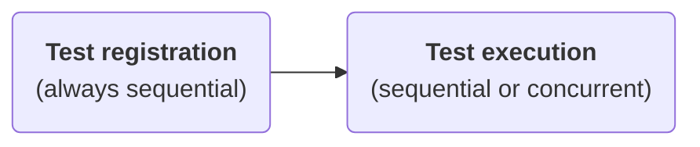

## Overview

TestBalloon has a DSL-based API with two core functions: `testSuite` and `test`.

* **Tests** are functions which either succeed or fail (throw). Tests contain your assertions. Code inside a test can suspend.

* **Test suites** structure your tests. They can nest across multiple levels. Code inside a test suite registers tests, test suites, and fixtures.

* You create top-level test suites as properties with a `by testSuite` delegation. TestBalloon will find them.

Tests and test suites accept strings as names.

!!! note

    You have now learned TestBalloon's DSL API. The rest on this page is plain Kotlin.

    **But please familiarize yourself with [Green code and blue code](#green-code-and-blue-code) and [TestBalloon's golden rule](#testballoons-golden-rule).**

```kotlin
--8<-- "TestsAndSuites.kt:ExampleTests"
```

1. Registers a top-level test suite. TestBalloon will automatically use the property's fully qualified name unless you provide an explicit name.
2. Registers a test.
3. An assertion from `kotlin-test`.
4. Registers a nested test suite.
5. A suspend function call.

## Custom functions for tests and test suites

You can define your own types of tests and test suites, like this test variant with an `iterations` parameter:

```kotlin
--8<-- "TestsAndSuites.kt:TestSuite-test"
```

!!! tip

    While the above code creates a custom test function, you can do the same with a test suite.

Find more details under [Configuration](configuration.md).

## Parameterized tests and test suites

In a test suite, you can use all Kotlin constructs (variable scopes, conditions, loops) to create tests and child test suites dynamically.

```kotlin
--8<-- "TestsAndSuites.kt:ParameterizedTests"
```

Parameterization works across test suites:

```kotlin
--8<-- "TestsAndSuites.kt:UserTest"
```


### Using value sources (generators)

Value sources help cover **test edge cases and/or random samples** without repetitive boilerplate code:

```kotlin
--8<-- "TestsAndSuites.kt:TransactionServiceTests-accepted-counts"
```

1. Edge cases.
2. Generating repeatable pseudo-random values with a seed.

## Green code and blue code

!!! info

    **For a DSL-based framework, it is paramount to be aware of the effects of closures and variable capturing.**

### Runtime phases

TestBalloon has two primary runtime phases:



The :testballoon: **test registration phase** is part of TestBalloon's setup: It creates the test element hierarchy, registering test suites, tests and fixtures, and configuring test elements. At the end, it knows exactly what to run. (1)
{ .annotate }

1. TestBalloon is fast to register tests. It can register and configure 1.7 million tests in 7 seconds on a decent Laptop. It also knows shortcuts if only parts of the test element hierarchy have been selected.

!!! info

    The :testballoon: test registration phase always completes before the :material-check-circle:{ .green } test execution phase starts.

The :material-check-circle:{ .green } **test execution phase** is where the action is. While the default is to run tests sequentially, concurrent execution can be configured at any level of the test element hierarchy.

### :testballoon: Blue code (registration phase)

In TestBalloon, all code outside the lambdas of tests, [fixtures](fixtures.md) and [execution wrappers](configuration.md#custom-extensions) is **registration-phase** code, or :testballoon: **blue code**:

```kotlin hl_lines="1-9 11-13"
--8<-- "TestsAndSuites.kt:ParameterizedTests"
```

### :material-check-circle:{ .green } Green code (execution phase)

Code inside the lambdas of tests, [fixtures](fixtures.md) and [execution wrappers](configuration.md#custom-extensions) is **execution-phase** code, or :material-check-circle:{ .green } **green code**:

```kotlin {hl_lines="10" .green-highlight}
--8<-- "TestsAndSuites.kt:ParameterizedTests"
```

## TestBalloon's golden rule

With power comes some responsibility. The golden rule is:

!!! danger

    **Never leak mutable state from :testballoon: blue code into :material-check-circle:{ .green } green code.**

Why is this important?

### ❌ This breaks

```kotlin
--8<-- "TestsAndSuites.kt:CalculatorTests-Broken"
```

1. `sum` is mutable state.
2. `sum` is mutated in blue code.
3. `sum` leaks into green code.

The above code will produce failing tests:


Why? All the additions to `sum` occurred in blue code before any green code would start. So green code inside tests can only see the latest blue-code state of `sum`, which is 45.

### ✅ This works

```kotlin
--8<-- "TestsAndSuites.kt:CalculatorTests-Healthy"
```

1. Blue code contains immutable state only.
2. Well, not entirely: The calculator is mutable. This works, because it is not mutated in blue code, but only in green code.
3. Using immutable state originating in blue code is safe.


Here, all operands and expected `sum` values were created as immutable state in blue code. This is always safe.

!!! info

    State leaks with closures, which run later or concurrently, can happen anywhere (flows, sequences, coroutines, anything lazy). For this reason, [YouTrack issue KT-15514](https://youtrack.jetbrains.com/issue/KT-15514) suggests to make the compiler emit a warning in such cases.
